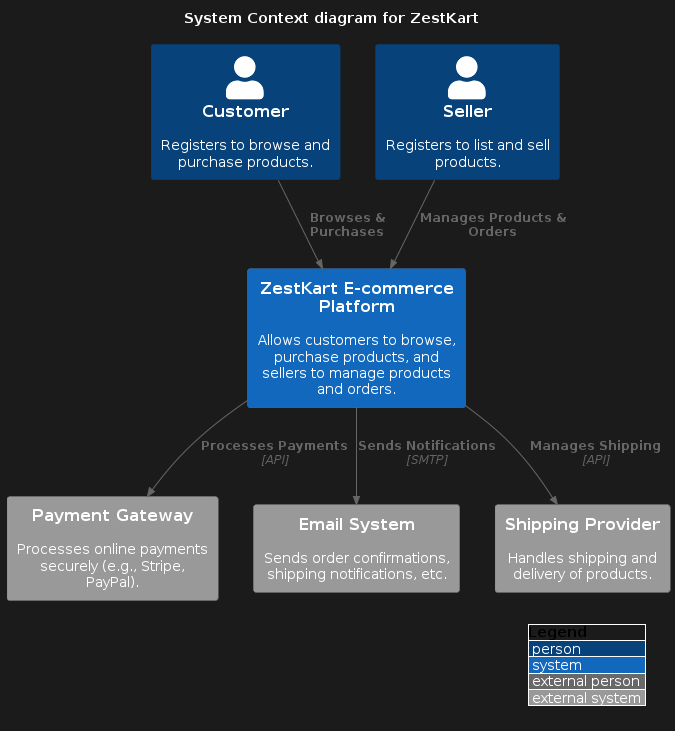
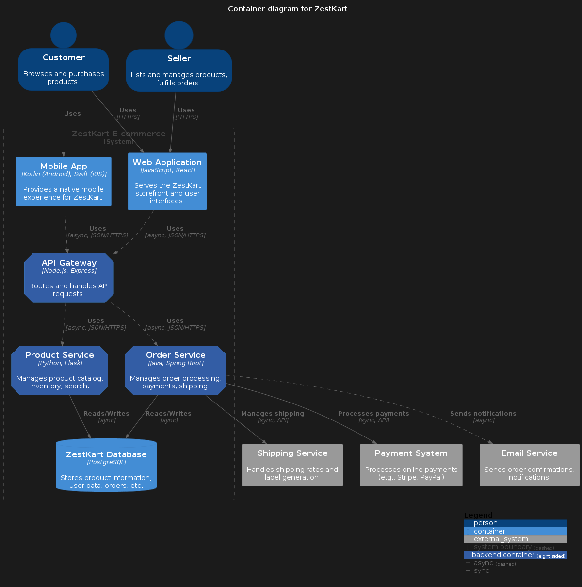

## System context diagram


```
@startuml  
!include [https://raw.githubusercontent.com/plantuml-stdlib/C4-PlantUML/master/C4_Context.puml](https://raw.githubusercontent.com/plantuml-stdlib/C4-PlantUML/master/C4_Context.puml "https://raw.githubusercontent.com/plantuml-stdlib/c4-plantuml/master/c4_context.puml")  
' uncomment the following line and comment the first to use locally  
' !include C4_Context.puml

LAYOUT_WITH_LEGEND()

title System Context diagram for ZestKart

Person(customer, "Customer", "Registers to browse and purchase products.")  
Person(seller, "Seller", "Registers to list and sell products.")  
System(zestkart, "ZestKart E-commerce Platform", "Allows customers to browse, purchase products, and sellers to manage products and orders.")

System_Ext(payment_gateway, "Payment Gateway", "Processes online payments securely (e.g., Stripe, PayPal).")  
System_Ext(email_system, "Email System", "Sends order confirmations, shipping notifications, etc.")  
System_Ext(shipping_provider, "Shipping Provider", "Handles shipping and delivery of products.")

Rel(customer, zestkart, "Browses & Purchases")  
Rel(seller, zestkart, "Manages Products & Orders")  
Rel(zestkart, payment_gateway, "Processes Payments", "API")  
Rel(zestkart, email_system, "Sends Notifications", "SMTP")  
Rel(zestkart, shipping_provider, "Manages Shipping", "API")  
@enduml
```
## Container diagram


```
@startuml  
!include [https://raw.githubusercontent.com/plantuml-stdlib/C4-PlantUML/master/C4_Container.puml](https://raw.githubusercontent.com/plantuml-stdlib/C4-PlantUML/master/C4_Container.puml "https://raw.githubusercontent.com/plantuml-stdlib/c4-plantuml/master/c4_container.puml")

SHOW_PERSON_OUTLINE()  
AddElementTag("backendContainer", $fontColor=$ELEMENT_FONT_COLOR, $bgColor="#335DA5", $shape=EightSidedShape(), $legendText="backend container\neight sided")  
AddRelTag("async", $textColor=$ARROW_FONT_COLOR, $lineColor=$ARROW_COLOR, $lineStyle=DashedLine())  
AddRelTag("sync", $textColor=$ARROW_FONT_COLOR, $lineColor=$ARROW_COLOR)

title Container diagram for ZestKart

Person(customer, "Customer", "Browses and purchases products.")  
Person(seller, "Seller", "Lists and manages products, fulfills orders.")

System_Boundary(c1, "ZestKart E-commerce") {  
    Container(web_app, "Web Application", "JavaScript, React", "Serves the ZestKart storefront and user interfaces.")  
    Container(mobile_app, "Mobile App", "Kotlin (Android), Swift (iOS)", "Provides a native mobile experience for ZestKart.")  
    Container(api_gateway, "API Gateway", "Node.js, Express", "Routes and handles API requests.", $tags="backendContainer")   
    Container(product_service, "Product Service", "Python, Flask", "Manages product catalog, inventory, search.", $tags="backendContainer")  
    Container(order_service, "Order Service", "Java, Spring Boot", "Manages order processing, payments, shipping.", $tags="backendContainer")  
    ContainerDb(database, "ZestKart Database", "PostgreSQL", "Stores product information, user data, orders, etc.")

}

System_Ext(payment_system, "Payment System", "Processes online payments (e.g., Stripe, PayPal)")  
System_Ext(email_service, "Email Service", "Sends order confirmations, notifications.")  
System_Ext(shipping_service, "Shipping Service", "Handles shipping rates and label generation.")

Rel(customer, web_app, "Uses", "HTTPS")  
Rel(customer, mobile_app, "Uses")  
Rel(seller, web_app, "Uses", "HTTPS")

Rel(web_app, api_gateway, "Uses", "async, JSON/HTTPS", $tags="async")  
Rel(mobile_app, api_gateway, "Uses", "async, JSON/HTTPS", $tags="async")  
Rel(api_gateway, product_service, "Uses", "async, JSON/HTTPS", $tags="async")   
Rel(api_gateway, order_service, "Uses", "async, JSON/HTTPS", $tags="async")  
Rel(product_service, database, "Reads/Writes", "sync", $tags="sync")  
Rel(order_service, database, "Reads/Writes", "sync", $tags="sync")

Rel(order_service, payment_system, "Processes payments", "sync, API", $tags="sync")  
Rel(order_service, email_service, "Sends notifications", "async", $tags="async")  
Rel(order_service, shipping_service, "Manages shipping", "sync, API", $tags="sync")

SHOW_LEGEND()  
@enduml
```